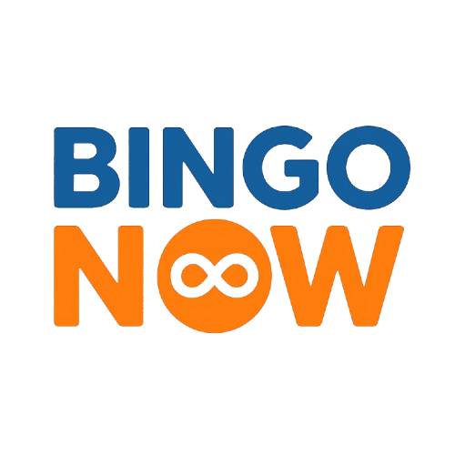

# 🎱 Projeto BingoNow


Sistema web para sorteio e controle de cartelas de bingo, com geração automática de PDF, sorteio em tempo real via Socket.IO, e interface amigável para operadores e participantes.

---

## 📌 Funcionalidades

- 📄 Geração de cartelas de bingo em PDF com nome do comprador.
- 🧑 Cadastro de compradores no sistema.
- 🧮 Sorteio de números com animações e atualização em tempo real via WebSocket.
- 🖨️ Impressão de todas as cartelas de uma vez.
- ✅ Identificação automática de cartela vencedora.
- 🧠 Detecção de cartelas "na boa" (faltando apenas um número para vencer).
- 🔄 Suporte a múltiplos tipos de sorteio (linha, coluna, cartela inteira, bola solta).

---

## 🧱 Estrutura do Projeto

```
PROJETO_BINGO/
│
├── static/
│   ├── css/
│   │   └── style.css         # Estilos centralizados do sistema
│   └── js/
│       ├── main.js           # Scripts da página inicial
│       └── draw.js           # Lógica de sorteio e comunicação via socket
│
├── templates/
│   ├── index.html            # Página principal (cadastro e geração de cartela)
│   ├── sorteio.html          # Página de sorteio de números
│   └── cartela.html          # Template de cartela em HTML para renderização do PDF
│
├── cartelas/                 # Cartelas geradas em PDF
│
├── app.py                    # Aplicação principal Flask com WebSocket
├── models.py                 # Definição do banco de dados com SQLAlchemy
└── requirements.txt          # Dependências do projeto
```

---

## 🚀 Como executar

### 📦 Pré-requisitos

- Python 3.10+
- `pip` ou `venv`
- Navegador moderno

### 🔧 Instalação

```bash
# Clone o repositório
git clone https://github.com/seu-usuario/PROJETO_BINGO.git
cd PROJETO_BINGO

# Crie e ative o ambiente virtual (opcional mas recomendado)
python -m venv venv
source venv/bin/activate  # Linux/Mac
venv\Scripts\activate     # Windows

# Instale as dependências
pip install -r requirements.txt
```

### ▶️ Execução

```bash
# Rode o app Flask com suporte a WebSocket
python app.py
```

Acesse no navegador: [http://localhost:5000](http://localhost:5000)

---

## 🧪 Tecnologias Utilizadas

- **Flask** - Framework web em Python
- **Flask-SocketIO** - Comunicação em tempo real (sorteio)
- **SQLAlchemy** - ORM para persistência no banco de dados
- **WeasyPrint** - Geração de PDF das cartelas
- **HTML5, CSS3, JavaScript** - Frontend moderno

---

## 📄 Funcionalidades Técnicas

- Organização de cartelas por letras B-I-N-G-O.
- Sorteio visual com animações.
- Cada cartela salva no banco com vínculo ao comprador.
- Geração de PDF usando template HTML.
- Interface separada para cadastro e sorteio.
- Notificações em tempo real para cartelas vencedoras.

---

## 🧑‍💻 Desenvolvedor

**Felipe de Souza Rosa - SI -  UFMS**  
📧 Entre em contato para contribuições ou sugestões!

Email: felipsouzarosa@gmail.com

---
